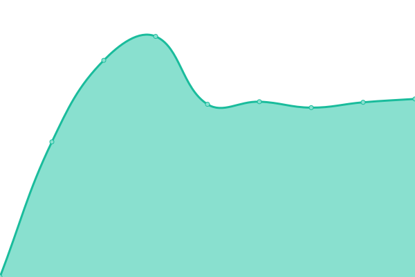
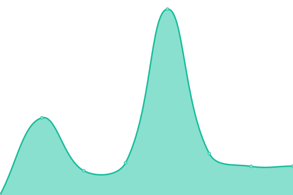

# [📈 Live Status](https://uptime.dgtl.tech): <!--live status--> **🟩 All systems operational**

This repository contains the open-source uptime monitor and status page for [Upptime](https://upptime.js.org), powered by [Upptime](https://github.com/upptime/upptime).

With [Upptime](https://upptime.js.org), you can get your own unlimited and free uptime monitor and status page, powered entirely by a GitHub repository. We use [Issues](https://github.com/upptime/upptime/issues) as incident reports, [Actions](https://github.com/upptime/upptime/actions) as uptime monitors, and [Pages](https://uptime.dgtl.tech) for the status page.

<!--start: status pages-->
<!-- This summary is generated by Upptime (https://github.com/upptime/upptime) -->
<!-- Do not edit this manually, your changes will be overwritten -->
<!-- prettier-ignore -->
| URL | Status | History | Response Time | Uptime |
| --- | ------ | ------- | ------------- | ------ |
|  DGTL.TECH Website | 🟩 Up | [dgtl-tech-website.yml](https://github.com/dgtl-llc/uptime/commits/HEAD/history/dgtl-tech-website.yml) | 

 922ms
     
 | 

<a href="https://status.dgtl.tech/history/dgtl-tech-website">100.00%</a>
    

|  [moon.dgtlnet.com](https://moon.dgtlnet.com) | 🟩 Up | [moon-dgtlnet-com.yml](https://github.com/dgtl-llc/uptime/commits/HEAD/history/moon-dgtlnet-com.yml) | 

 1009ms
     
 | 

<a href="https://status.dgtl.tech/history/moon-dgtlnet-com">100.00%</a>
    

|  [Network Block List](https://networkbl.com/) | 🟩 Up | [network-block-list.yml](https://github.com/dgtl-llc/uptime/commits/HEAD/history/network-block-list.yml) | 

 643ms
     
 | 

<a href="https://status.dgtl.tech/history/network-block-list">100.00%</a>
    

|  Billing system - DGTL TECH UK | 🟩 Up | [billing-system-dgtl-tech-uk.yml](https://github.com/dgtl-llc/uptime/commits/HEAD/history/billing-system-dgtl-tech-uk.yml) | 

 951ms
     
 | 

<a href="https://status.dgtl.tech/history/billing-system-dgtl-tech-uk">100.00%</a>
    

|  Billing system - DGTL Technologies LLC | 🟩 Up | [billing-system-dgtl-technologies-llc.yml](https://github.com/dgtl-llc/uptime/commits/HEAD/history/billing-system-dgtl-technologies-llc.yml) | 

 872ms
     
 | 

<a href="https://status.dgtl.tech/history/billing-system-dgtl-technologies-llc">100.00%</a>
    

|  MyMail Node [RU] | 🟩 Up | [my-mail-node-ru.yml](https://github.com/dgtl-llc/uptime/commits/HEAD/history/my-mail-node-ru.yml) | 

 1517ms
     
 | 

<a href="https://status.dgtl.tech/history/my-mail-node-ru">100.00%</a>
    

|  [TCP ping](1.1.1.1) | 🟩 Up | [tcp-ping.yml](https://github.com/dgtl-llc/uptime/commits/HEAD/history/tcp-ping.yml) | 

 59ms
     
 | 

<a href="https://status.dgtl.tech/history/tcp-ping">100.00%</a>
    

|  [Google](https://www.google.com) | 🟩 Up | [google.yml](https://github.com/dgtl-llc/uptime/commits/HEAD/history/google.yml) | 

 166ms
     
 | 

<a href="https://status.dgtl.tech/history/google">100.00%</a>
    

<!--end: status pages-->

[**Visit our status website →**](https://uptime.dgtl.tech)

## 📄 License

- Powered by: [Upptime](https://github.com/upptime/upptime)
- Code: [MIT](./LICENSE) © [Upptime](https://upptime.js.org)
- Data in the `./history` directory: [Open Database License](https://opendatacommons.org/licenses/odbl/1-0/)
